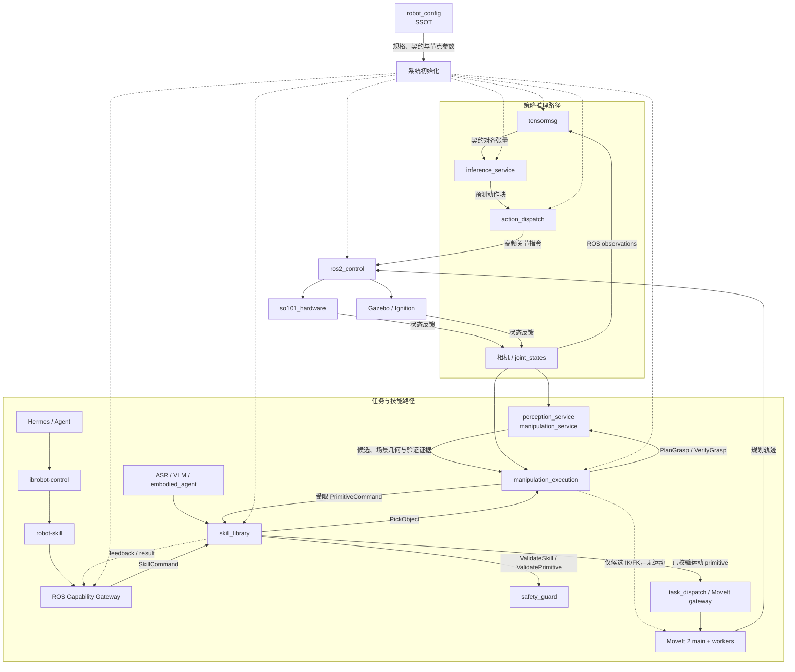

# IB-Robot 核心源码库 (Source Code)

> 本目录包含了 IB-Robot 框架的所有核心 ROS 2 功能包。通过**契约驱动 (Contract-driven)** 的架构设计，实现了高层 AI 推理与底层机器人控制的深度解耦与无缝集成。

---

## 核心设计理念：配置驱动中心 (Configuration-as-Data)

IB-Robot 采用了 **`robot_config`** 作为全系统的“唯一真理源 (Single Source of Truth)”。

在这种架构下，开发者的关注点从繁琐的节点连接转移到了高层的规格定义：
- **本体定义**: 所有的关节限位、控制器映射、传感器外参均在 YAML 中声明。
- **自动合成**: `robot_config` 会根据 YAML 动态合成 AI 模型所需的通讯契约（Contract），消除人工对齐误差。
- **能力插拔**: 仅需通过启动参数，即可一键在“纯硬件调试”、“MoveIt 规划”、“端到端 AI 推理”与可选的语音 ASR 输入之间切换。

---

## 系统架构与数据流

---

## 功能包深度解析

### 1. 📂 `robot_config` — 系统总控与规格中心
系统的“大脑”与决策入口。
- **统一入口**: 提供 `robot.launch.py` 脚本，协调感知、推理、调度各层的启动顺序。
- **契约合成器**: 内置 `contract_builder`，自动为 ACT/Pi0 等模型生成输入输出映射。
- **模块化构建**: 采用 `launch_builders`模式，将复杂的启动逻辑拆解为控制、仿真、感知、执行四大模块。

### 2. 📂 `inference_service` — 模型推理服务端
一个高性能、可扩展的模型部署后端。
- **多模型适配**: 统一封装了 ACT、Diffusion Policy、Pi0.5 及 SmolVLA 等主流具身模型。
- **异步拉取**: 采用 Action 通讯机制，支持按需触发推理，有效节省计算资源。
- **显式部署选择**: 通过 `inference_manifest.json` 的命名 deployment 选择 Torch CPU/CUDA/NPU 或编译后端，不进行隐式硬件切换。

### 3. 📂 `action_dispatch` — 动作调度与安全小脑
负责将高层张量转化为机器人可执行的连贯动作。
- **Action Chunking**: 管理长序列动作块，内置线性插值逻辑，确保关节运动平滑无抖动。
- **双模支持**: 同时支持 `model_inference`（高频话题）和 `moveit_planning`（轨迹动作）两种执行模式。
- **水位线监控**: 实时监控动作队列状态，在数据中断时提供 Hold/Stop 等安全降级策略。

### 4. 📂 `tensormsg` — LeRobot ↔ ROS 2 协议枢纽
*(拟更名为 `tensormsg`)*
- **实时序列化**: 实现 ROS 2 消息与 NumPy/Torch 张量之间的高性能转换。
- **时戳对齐**: 采用 `asof` 采样策略，确保多传感器观测数据在时间轴上精确对齐。

### 5. 📂 `robot_runtime` — 机器人运行时契约
- **公共接口**: 定义 RuntimeStatus、能力声明、接口描述 schema，是通用层与机器人套件之间唯一的依赖边界。
- **Mock 运行时**: 提供 `mock_runtime` provider，让通用包在没有任何机器人包的情况下完成契约链验证。

### 6. 📂 `robots/so101` — SO-101 运行时套件
- **`so101_sdk` / `feetech_sdk`**: 纯 C++ 舵机与机械臂 SDK（含 Python 绑定），不依赖任何 ROS 接口。
- **`so101_hardware`**: ros2_control 硬件插件，与上游 ML 依赖完全隔离。
- **`so101_description`**: URDF/xacro、STL 网格、MuJoCo 模板与 Gazebo 插件配置的唯一来源。
- **`so101_motion`**: 运动服务（`motion_server`、Placo servo、隔离 IK/FK worker 池）与 MoveIt 配置。
- **`so101_robot`**: 独立可部署的运行时入口（`runtime.launch.py` + profile），通过 `runtime.provider` 接入通用层。

### 8. 📂 `voice_asr_service` — 语音识别接入层
- **统一入口**: `voice_asr_node` 提供麦克风实时识别和音频文件识别两种入口。
- **配置收敛**: 业务参数由 `robot_config` 中的 `robot.voice_asr` 注入；包内 launch 仅保留调试用途。
- **稳健失败**: 模型初始化失败时会拒绝识别请求并返回明确错误，而不是在服务回调中直接崩溃。

### 9. 📂 `manipulation_execution` — 抓取闭环执行层
- **Agent 原子能力**: 将 Hermes 的一次 `pick_object` 调用转换为完整抓取状态机。
- **动态安全执行**: GraspGen 候选经 IK/FK 补偿后，仍通过 `skill_library` 和 `safety_guard` 执行。
- **结果闭环**: 区分运动完成和真实抓取成功，并融合夹爪、电流与深度证据。

---

## 快速开发命令

请确保在操作前已在根目录执行过 `source .shrc_local`。

| 任务 | 命令示例 |
| :--- | :--- |
| **全量编译** | `./scripts/build.sh --clean` |
| **启动 MoveIt 调试** | `ros2 launch robot_config robot.launch.py control_mode:=moveit_planning use_sim:=true` |
| **启动 AI 推理** | `ros2 launch robot_config robot.launch.py control_mode:=model_inference use_sim:=true with_inference:=true` |
| **配置一致性检查** | `python3 scripts/validate_config.py` |

---

## 许可证 (License)

本项目源码遵循 Apache License 2.0；各 ROS 2 包的许可声明以其 `package.xml` 为准。
